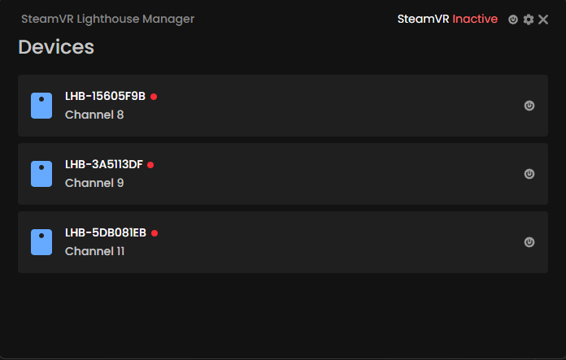

## SteamVR Lighthouse Manager 
A tool to control SteamVR Base Stations 2.0 on your PC.  It does not require a SteamVR Headset like HTC Vive or Valve Index, but still requires Bluetooth module to be enabled on your system.

 

### Features
- Control base station power status (awake, sleep) with Bluetooth LE.
- Control base station channel to operate on.
- Automated base station power control at the start and end of the SteamVR session.

### Requirements
- Bluetooth LE (4.0 or higher) 
- SteamVR Base Station 2.0 

### Installation
 #### Windows
 Grab latest release from [Release Tab](https://github.com/DHCPCD9/go-steamvr-lighthouse-manager/releases)
 #### Linux
 If you are using arch-based distro, then you can install [steamvr-lighthouse-manager-git](https://aur.archlinux.org/packages/steamvr-lighthouse-manager-git) from AUR.
 Otherwise you can compile youself using wails, requirements state [here](https://aur.archlinux.org/packages/steamvr-lighthouse-manager-git)
 #### MacOS
 Install golang, wails and compile by yourself.

### How to use 
1. Install & Run the program.
2. Now all Base Stations should turn on and off automatically, if you want to disable it, just click on the "Settings" icon at the top and turn it off.

### License
[GPLv3](https://github.com/DHCPCD9/go-steamvr-lighthouse-manager/blob/main/LICENSE)

### Contact
 - VRChat: [Alumi Shinamo](https://vrchat.com/home/user/usr_98358fea-8df8-4c08-ab4f-db555ae4e959)
 - X: [@AlumiShinamo](https://x.com/AlumiShinamo)
 - Discord: @dhcpcd

### Sponsor
 - USDT TRC20: TDKHKZEnZihb1grhHiFanBaPv2TF9ADdDF
 - BTC: bc1qk6hynnya9c5dexluhhcgukq598eunffw5yntpa
 - LTC: MNEJjjZU1gmr67snvs8XB4FmFwfwAm952a
 - ETH Mainnet: 0x67EFB56Fa96374571Af0c29CD38De89D42b20E83
